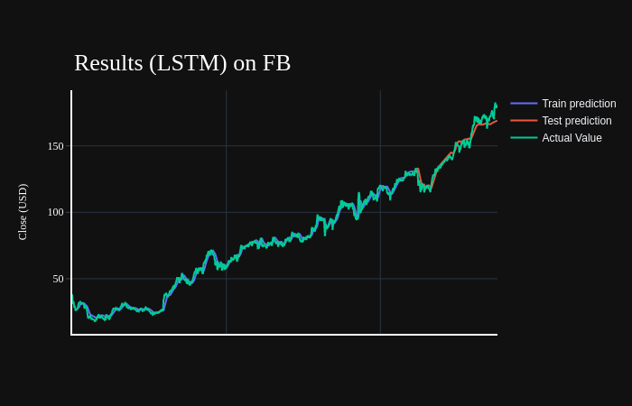
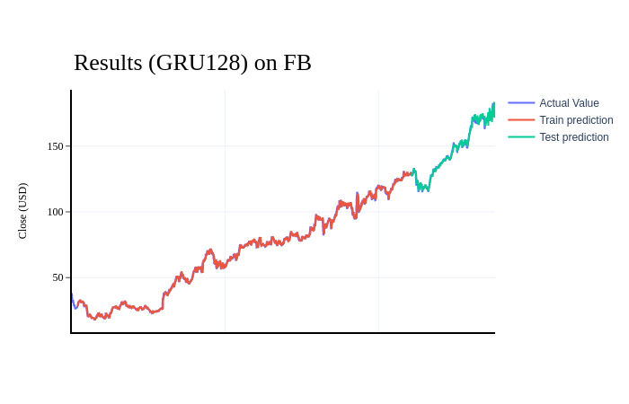
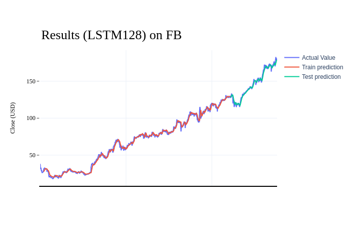

# Stock Price Prediction Uing Deep Learning Method

#### Investigating some attributes of deep learning methods when apply to stock price prediction problem
LSTM and GRU are usually the common approaches to predict future stock price on historical stock price.

There are four different companies' stock price from the 1980s to 2010s:
- AAPL (Apple)
- FB (Facebook)
- TSLA (Tesla)
- MSFT (Microsoft)

Some result's images:

Some results when apply model trained on one company to another company:

